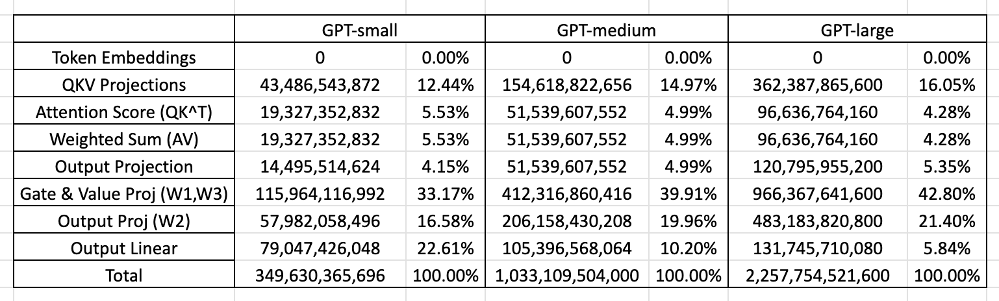
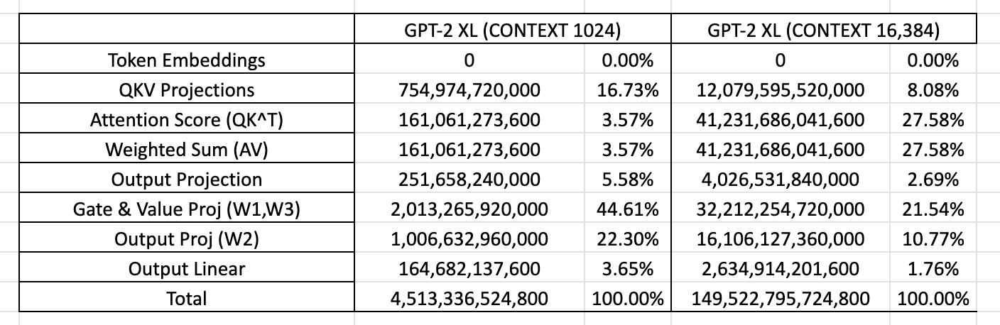

Problem (unicode1): Understanding Unicode (1 point)
(a) What Unicode character does chr(0) return?
'\x00'
(b) How does this character’s string representation (__repr__()) differ from its printed representation?
'\x00' vs Null character
(c) What happens when this character occurs in text? It may be helpful to play around with the
following in your Python interpreter and see if it matches your expectations:
>>> chr(0)
>>> print(chr(0))
>>> "this is a test" + chr(0) + "string"
>>> print("this is a test" + chr(0) + "string")
string representation
'this is a test\x00string'
Print: 
this is a teststring

Problem (unicode2): Unicode Encodings
What are some reasons to prefer training our tokenizer on UTF-8 encoded bytes, rather than
UTF-16 or UTF-32? It may be helpful to compare the output of these encodings for various
input strings.
Answer:
UTF-8 is more space efficient for texts that are primarily in ASCII, as it uses one byte for
ASCII characters, while UTF-16 and UTF-32 use two and four bytes respectively. UTF-8 is also
backward compatible with ASCII, making it easier to handle legacy systems. Additionally, UTF-8 is widely used on the web and in many programming languages, making it a more practical choice for interoperability.

Consider the following (incorrect) function, which is intended to decode a UTF-8 byte string into
a Unicode string. Why is this function incorrect? Provide an example of an input byte string
that yields incorrect results.
def decode_utf8_bytes_to_str_wrong(bytestring: bytes):
return "".join([bytes([b]).decode("utf-8") for b in bytestring])
Answer:
こ
The function is incorrect because it decodes each byte separately as its own UTF-8 sequence instead of decoding the full byte string at once, so any character encoded with multiple UTF-8 bytes (like é) will cause a UnicodeDecodeError or incorrect characters instead of the intended single Unicode character.

(c) Give a two byte sequence that does not decode to any Unicode character(s).
Answer:
b'\xe3\x81'
list(b'\xe3\x81') = [227, 129]
The byte 0xE3 indicates the start of a 3-byte UTF-8 character, which must be followed by two continuation bytes. However, in the sequence b'\xe3\x81', there is only one following byte, and although 0x81 is a valid continuation byte, the sequence is still incomplete because a third continuation byte is missing. Since UTF-8 does not allow truncated or partial multi-byte characters, this 2-byte sequence cannot be decoded into any valid Unicode character and will always raise a decode error.

Problem (transformer_accounting): Transformer LM resource accounting (5 points): Refer sheet: https://docs.google.com/spreadsheets/d/1Rl0c0pFwpkKEoTXUP5EMbv3ZgZEMwPsn/edit?usp=sharing&ouid=109510744950242843494&rtpof=true&sd=true
(a) Consider GPT-2 XL, which has the following configuration:
vocab_size : 50,257
context_length : 1,024
num_layers : 48
d_model : 1,600
27
num_heads : 25
d_ff : 6,400
Suppose we constructed our model using this configuration. How many trainable parameters
would our model have? Assuming each parameter is represented using single-precision floating
point, how much memory is required to just load this model?
Answer: For FP32 (single-precision), each parameter takes 4 bytes.
So memory to load the model weights is: 2,127,057,600×4=8,508,230,400 bytes
That is: ~8.51 GB. So we need ~8.5 GB (~7.9 GiB) just to store the parameters (not counting optimizer states, activations, KV cache, etc.).

(b) Identify the matrix multiplies required to complete a forward pass of our GPT-2 XL-shaped
model. How many FLOPs do these matrix multiplies require in total? Assume that our input
sequence has context_length tokens.
Deliverable: A list of matrix multiplies (with descriptions), and the total number of FLOPs
required.
1. QKV Projections: N × 6 × L × D²
2. Attention score: QK^T: N × 2 × L² × D
3. Weighted Sum (AV): N × 2 × L² × D
4. Output Projection: N × 2 × L × D²
5. Gate & Value Proj (W1,W3): N × 4 × L × D × D_ff
6. Output Proj (W2): N × 2 × L × D × D_ff
7. Output Linear: N × L × D × V
Total: 4,513,336,524,800 FLOPs

(c) Based on your analysis above, which parts of the model require the most FLOPs?
Gate and value projection in FFN, require about 44% of the total FLOPs.

(d) Repeat your analysis with GPT-2 small (12 layers, 768 d_model, 12 heads), GPT-2 medium (24
layers, 1024 d_model, 16 heads), and GPT-2 large (36 layers, 1280 d_model, 20 heads). As the
model size increases, which parts of the Transformer LM take up proportionally more or less of
the total FLOPs?
Deliverable: For each model, provide a breakdown of model components and its associated
FLOPs (as a proportion of the total FLOPs required for a forward pass). In addition, provide a
one-to-two sentence description of how varying the model size changes the proportional FLOPs
of each component.

As we increase model size, attention flops and AV sum component start decreasing and FFN flops start increasing. The QKV projections and other linear projections like output projection also increases.
(e) Take GPT-2 XL and increase the context length to 16,384. How does the total FLOPs for one
forward pass change? How do the relative contribution of FLOPs of the model components
change?
FLOPs increase by 33x

As we increase context length, the QKV projections and other linear projections contribution decrease and attention scoring increases a lot. This is owing to L² growth for attention scoring.
